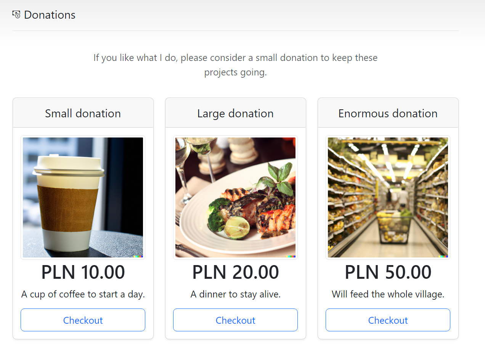
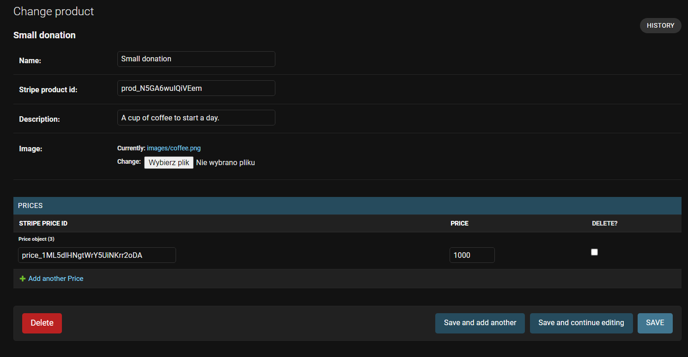

# Buy me a coffee - donation website
Simple website/template that can be used as a donation website. 

## Tech
- Pytho django
- Stripe checkout for payments
- SQLite
- Email via smtp (optional)

## Use
To use this repo, you have to do some configuration.

### Stripe
Create a stripe account, get your API keys https://dashboard.stripe.com/test/apikeys, 
add products (various donations) and give them prices.
You will need product ID and price ID later.
Webhook is a bit more tricky, check https://justdjango.com/blog/django-stripe-payments-tutorial 
where it is written how to do it. This repo was based on that tutorial

###ENV file
Create an env file with following stuff:

SECRET_KEY=
STRIPE_SK=
STRIPE_PK=
STRIPE_WEBHOOK_SECRET=
EMAIL_HOST=
EMAIL_HOST_USER=
EMAIL_HOST_PASSWORD=
EMAIL_PORT=
EMAIL_USE_TLS=

### Django database
Add all your products (from stripe) to django database. Keep in mind to write stripe product id and its price id

### Deploy
Deploy as you wish, I personally use Cloud Run.

You also need to change some stuff after or during deployment
-Views.py
Change domain = "https://yourdomain.com" to real domain
-settings.py
Add your domains to ALLOWED_HOSTS and DEBUG= FALSE(!)

#### Update

You may need to update the requirements.txt, depends when to use this.

Cheers :)
